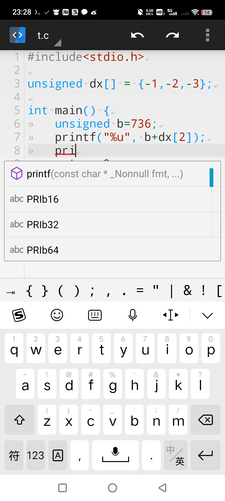
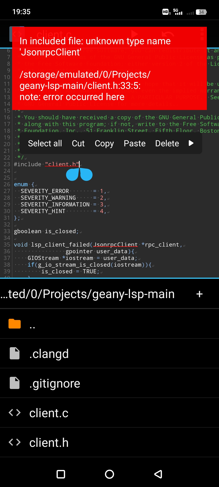
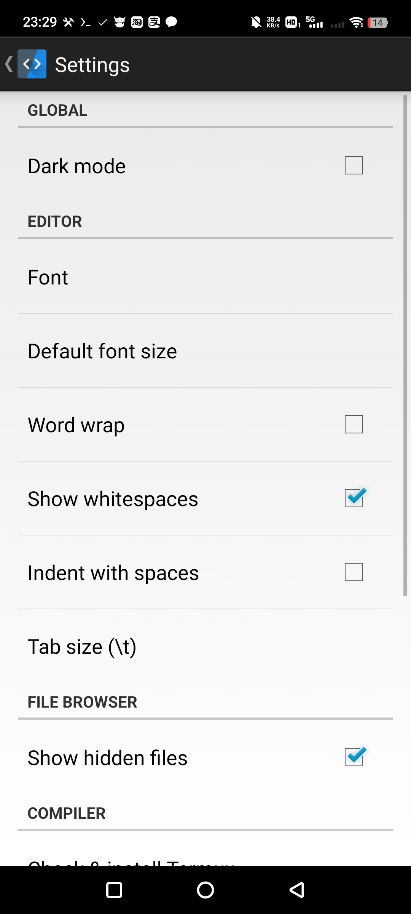

# C++ SD Android Downloads

Official public download page for **C++ SD**, an Android C/C++17 editor and compiler.

## Download

Download the latest signed APK from the [Releases](https://github.com/hamadax2/CppSD-Downloads/releases) page.

- Universal Android APK
- Signed release build
- SHA-256 checksum included with each release
- Supports C/C++ editing, Find/Replace, Format Code, clangd completion, and offline Clang tools

## Screenshots

### C/C++ editor with code completion

The editor provides syntax highlighting, line numbers, code completion, and function signatures while writing C or C++ code.



### Compiler diagnostics and project browser

Compiler and language-server diagnostics are displayed directly over the source code, while the project browser provides quick access to files and folders.



### Editor and compiler settings

The Settings screen provides controls for dark mode, font size, word wrap, whitespace display, indentation, hidden files, and compiler options.



## Privacy policy

Read the [C++ SD Privacy Policy](PRIVACY_POLICY.txt) for information about local data, network requests, and advertising services.

## Verify the checksum

```sh
sha256sum -c SHA256SUMS.txt
```

This is a **download-only repository**. Application source code is not included. For support, open an issue in this repository.
